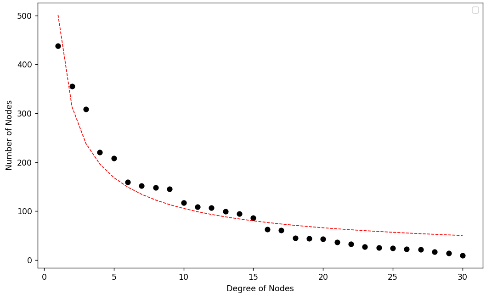
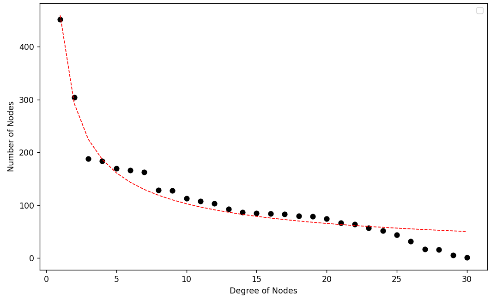
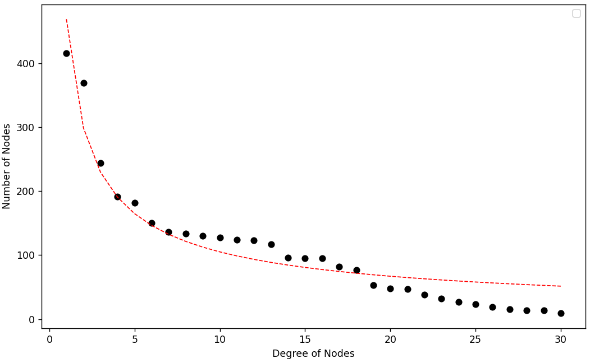

# Peer-to-Peer Gossip Network

This project implements a decentralized peer-to-peer (P2P) network using a Gossip protocol. The network consists of **Seed Nodes** and **Peer Nodes** to facilitate message exchange and failure detection.

## 📌 Overview

### 🌱 Seed Node

Seed nodes serve as initial points of contact for new peers joining the network. They maintain a list of active peers and facilitate new peer discovery.

**Responsibilities:**
- Maintain a list of active peer nodes.
- Respond to **Get Peer List** requests from new peer nodes.
- Help new peers establish connections.
- Receive **Death** notifications when peers disconnect.

### 🔗 Peer Node

Peer nodes are the main participants in the network. They maintain peer-to-peer connections, exchange messages, and monitor node liveliness.

**Responsibilities:**
- Connect to at least ⌊n/2⌋ + 1 seed nodes.
- Establish and maintain connections with other peers.
- Periodically check the liveliness of connected peers.
- Exchange messages using a Gossip-based protocol.
- Handle incoming data requests.

## 🔄 Message Exchange

Seed and peer nodes communicate using structured messages:

### Seed Node Messages:
- **Get Peer List** → A peer requests the list of active peers.
- **Peer List** → The seed node responds with active peers.

### Peer-to-Peer Messages:
- **Peer Request** → Request connection with another peer.
- **Peer Reply** → Accept a connection request.
- **Liveliness** → Check if a peer is still active.
- **Liveliness Reply** → Confirm presence.
- **getData** → Request data from a peer.
- **Message** → Send data to another peer.
- **Death** → Notify seed node about peer disconnection.

## 🔍 Connectivity and Distribution of Peer Degrees

In our Gossip protocol, each peer randomly selects a subset of other peers, following a power-law degree distribution. The degree of a node (i.e., how many peers it connects to) will have a mean and a standard deviation.

If the peer degree distribution were approximately normal, we could describe the probability of a peer having a certain number of connections using mean ± standard deviation. However, because we are using a power-law distribution, the standard deviation is not tightly bound, meaning a few nodes will have extremely high degrees while most have low degrees.

👉 Key Connection to ± n / 2 Standard Deviation:

If we assume a normal approximation for simplicity, the mean degree of a peer can be some fraction of the total peers, say 
𝜇
≈
𝑛
/
2.
The standard deviation of the degree (
𝜎
) would determine the expected range of connectivity for a node.
𝜇
±
𝑛
/
2
𝜎
would define a range of peer connections—most nodes would fall within this range, while a few hubs (high-degree nodes) would be outside.
This helps ensure the power-law structure, where some nodes have much higher connectivity than others.

## Example Graphs Demonstrating Power Law Distribution





## 📊 Seed Node Connection Threshold (⌊n/2⌋ + 1) and Statistical Significance

The requirement that each peer connects to at least ⌊n/2⌋ + 1 seed nodes ensures network robustness.
If you consider the number of seed connections per peer as a random variable, you can measure its distribution's mean and standard deviation.
Assuming a normal distribution of connections, the probability of a node falling significantly below ⌊n/2⌋ + 1 connections could be quantified using 
±
𝑛
/
2
 standard deviation.
Ensuring that most nodes are within one standard deviation (
𝜇
±
𝜎
) of the required connections helps maintain network connectivity.

## ⚠️ Failure Detection

Each peer pings its connected nodes and expects a response. If a node fails to respond **3 consecutive times**, it is considered **dead**.

## 🛠 Running the Network

### Start a Seed Node:
```sh
python3 seed.py
```

### Start Peer Nodes:
```sh
python3 peer.py
```

### Monitor Network Activity:
In a peer node terminal:
- Press `1` → Display active peer connections.
- Press `2` → View exchanged messages.

### Clean Up Logs:
```sh
python3 logRemover.py
```

### Stop a Peer Node:
- Press `Ctrl + C`
- Enter any input other than `1` or `2`

## 📁 Logs

- Logs are stored in the `logs/` directory.
- Seed node logs: `logs/seeds/`
- Peer node logs: `logs/peers/`
- Logs capture connection activity, liveliness checks, and peer failures.

## 👥 Contributors

- [Dishit Sharma (B22CS082)](https://github.com/sharmajii7)
- [Kiran S (B22CS100)](https://github.com/Kiran-velan)

---

